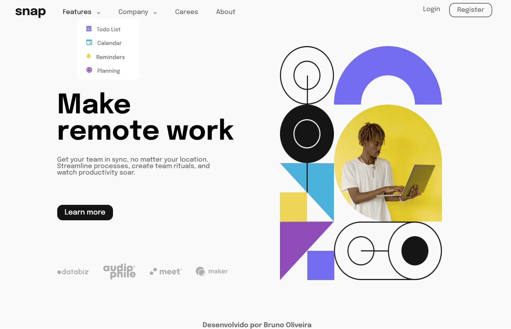

## 📝 Desafio section-dropdown-navigation
Projeto de desafio do frontend mentor para criação de uma seção de introdução com navegação suspensa.

<h4><a href="https://www.frontendmentor.io/challenges/intro-section-with-dropdown-navigation-ryaPetHE5">Link do desafio</a></h4>

## 💻 Screenshot do projeto

Designer 01

Designer 02

<h4 align="center"><a href="https://brunooliveira16.github.io/section-dropdown-navigation/">Clique aqui e visite o projeto</a></h4>

## 📚 Descrição

Construir uma seção de introdução com navegação suspensa para que os usuários consigam visualizar os menus suspensos relevantes no desktop e no celular ao interagir com os links de navegação;
- **Layout Responsivo:** Visualizar o layout ideal para o conteúdo, dependendo do tamanho da tela do dispositivo;
- **Interação dos elementos:** Veja os estados de foco para todos os elementos interativos na página;
- **Meun Dropdown:** criação de sub-menus que interagem com o usuário ao clicar no objeto;
---

## 💼 Tecnologias utilizadas
- HTML;
- CSS;

---

## 🙋🏻‍♂️ Autor

Bruno Oliveira

